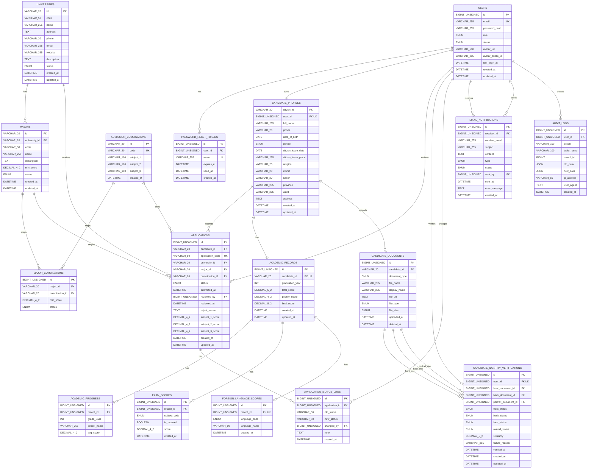

# Thiet ke vat ly CSDL ver2

Tai lieu nay duoc lap theo file migration hien tai tai `backend/src/database/migrate.ts`.

## Quy uoc chung

- He quan tri CSDL: MySQL.
- Engine: `InnoDB`.
- Charset/Collation: `utf8mb4` / `utf8mb4_unicode_ci`.
- Cac bang su dung thoi gian tao mac dinh `CURRENT_TIMESTAMP`.
- Cac bang co `updated_at` su dung `CURRENT_TIMESTAMP ON UPDATE CURRENT_TIMESTAMP`.
- Migration hien tai drop va tao lai toan bo bang, co tat `FOREIGN_KEY_CHECKS` trong giai doan drop.

## Thu tu khoi tao bang

1. `users`
2. `password_reset_tokens`
3. `universities`
4. `majors`
5. `admission_combinations`
6. `major_combinations`
7. `candidate_profiles`
8. `applications`
9. `academic_records`
10. `academic_progress`
11. `exam_scores`
12. `foreign_language_scores`
13. `candidate_documents`
14. `candidate_identity_verifications`
15. `application_status_logs`
16. `email_notifications`
17. `audit_logs`

## ERD tong quan



## 1) Bang `users`

Luu tai khoan dang nhap cua thi sinh va quan tri vien.

```sql
CREATE TABLE IF NOT EXISTS users (
  id BIGINT UNSIGNED AUTO_INCREMENT PRIMARY KEY,
  email VARCHAR(255) NOT NULL,
  password_hash VARCHAR(255) NOT NULL,
  role ENUM('CANDIDATE','ADMIN') NOT NULL,
  status ENUM('ACTIVE','LOCKED','PENDING') NOT NULL DEFAULT 'ACTIVE',
  avatar_url VARCHAR(500) NULL COMMENT 'Cloudinary secure URL cua avatar',
  avatar_public_id VARCHAR(255) NULL COMMENT 'Cloudinary public_id de xoa asset',
  last_login_at DATETIME NULL,
  created_at DATETIME NOT NULL DEFAULT CURRENT_TIMESTAMP,
  updated_at DATETIME NOT NULL DEFAULT CURRENT_TIMESTAMP ON UPDATE CURRENT_TIMESTAMP,
  UNIQUE KEY uq_users_email (email)
) ENGINE=InnoDB DEFAULT CHARSET=utf8mb4 COLLATE=utf8mb4_unicode_ci;
```

## 2) Bang `password_reset_tokens`

Luu token dat lai mat khau.

```sql
CREATE TABLE IF NOT EXISTS password_reset_tokens (
  id BIGINT UNSIGNED AUTO_INCREMENT PRIMARY KEY,
  user_id BIGINT UNSIGNED NOT NULL,
  token VARCHAR(255) NOT NULL,
  expires_at DATETIME NOT NULL,
  used_at DATETIME NULL,
  created_at DATETIME NOT NULL DEFAULT CURRENT_TIMESTAMP,
  UNIQUE KEY uq_prt_token (token),
  KEY idx_prt_user_id (user_id),
  CONSTRAINT fk_prt_user
    FOREIGN KEY (user_id) REFERENCES users(id)
) ENGINE=InnoDB DEFAULT CHARSET=utf8mb4 COLLATE=utf8mb4_unicode_ci;
```

## 3) Bang `universities`

Luu danh muc truong dai hoc. Khoa chinh `id` la ma noi bo dang chuoi, vi du `DH000001`.

```sql
CREATE TABLE IF NOT EXISTS universities (
  id VARCHAR(20) PRIMARY KEY,
  code VARCHAR(50) NOT NULL,
  name VARCHAR(255) NOT NULL,
  address TEXT NULL,
  phone VARCHAR(20) NULL,
  email VARCHAR(255) NULL,
  website VARCHAR(255) NULL,
  description TEXT NULL,
  status ENUM('ACTIVE','INACTIVE') NOT NULL DEFAULT 'ACTIVE',
  created_at DATETIME NOT NULL DEFAULT CURRENT_TIMESTAMP,
  updated_at DATETIME NOT NULL DEFAULT CURRENT_TIMESTAMP ON UPDATE CURRENT_TIMESTAMP,
  KEY idx_universities_code (code)
) ENGINE=InnoDB DEFAULT CHARSET=utf8mb4 COLLATE=utf8mb4_unicode_ci;
```

## 4) Bang `majors`

Luu nganh dao tao thuoc tung truong. Khoa chinh `id` la ma noi bo dang chuoi, vi du `NH000001`.

```sql
CREATE TABLE IF NOT EXISTS majors (
  id VARCHAR(20) PRIMARY KEY,
  university_id VARCHAR(20) NOT NULL,
  code VARCHAR(50) NOT NULL,
  name VARCHAR(255) NOT NULL,
  description TEXT NULL,
  min_score DECIMAL(4,2) NULL,
  status ENUM('ACTIVE','INACTIVE') NOT NULL DEFAULT 'ACTIVE',
  created_at DATETIME NOT NULL DEFAULT CURRENT_TIMESTAMP,
  updated_at DATETIME NOT NULL DEFAULT CURRENT_TIMESTAMP ON UPDATE CURRENT_TIMESTAMP,
  KEY idx_majors_university_code (university_id, code),
  KEY idx_majors_university_id (university_id),
  CONSTRAINT fk_majors_university
    FOREIGN KEY (university_id) REFERENCES universities(id)
) ENGINE=InnoDB DEFAULT CHARSET=utf8mb4 COLLATE=utf8mb4_unicode_ci;
```

## 5) Bang `admission_combinations`

Luu to hop xet tuyen.

```sql
CREATE TABLE IF NOT EXISTS admission_combinations (
  id VARCHAR(20) PRIMARY KEY,
  code VARCHAR(20) NOT NULL,
  subject_1 VARCHAR(100) NOT NULL,
  subject_2 VARCHAR(100) NOT NULL,
  subject_3 VARCHAR(100) NOT NULL,
  created_at DATETIME NOT NULL DEFAULT CURRENT_TIMESTAMP,
  UNIQUE KEY uq_admission_combination_code (code)
) ENGINE=InnoDB DEFAULT CHARSET=utf8mb4 COLLATE=utf8mb4_unicode_ci;
```

## 6) Bang `major_combinations`

Luu quan he nhieu-nhieu giua nganh va to hop xet tuyen.

```sql
CREATE TABLE IF NOT EXISTS major_combinations (
  id BIGINT UNSIGNED AUTO_INCREMENT PRIMARY KEY,
  major_id VARCHAR(20) NOT NULL,
  combination_id VARCHAR(20) NOT NULL,
  min_score DECIMAL(4,2) NULL,
  status ENUM('ACTIVE','INACTIVE') NOT NULL DEFAULT 'ACTIVE',
  UNIQUE KEY uq_major_combination (major_id, combination_id),
  KEY idx_mc_major_id (major_id),
  KEY idx_mc_combination_id (combination_id),
  CONSTRAINT fk_mc_major
    FOREIGN KEY (major_id) REFERENCES majors(id),
  CONSTRAINT fk_mc_combination
    FOREIGN KEY (combination_id) REFERENCES admission_combinations(id)
) ENGINE=InnoDB DEFAULT CHARSET=utf8mb4 COLLATE=utf8mb4_unicode_ci;
```

## 7) Bang `candidate_profiles`

Luu ho so ca nhan cua thi sinh. `citizen_id` la khoa chinh va lien ket voi cac bang nghiep vu ung vien.

```sql
CREATE TABLE IF NOT EXISTS candidate_profiles (
  citizen_id VARCHAR(20) PRIMARY KEY,
  user_id BIGINT UNSIGNED NOT NULL,
  full_name VARCHAR(255) NOT NULL,
  phone VARCHAR(20) NULL,
  date_of_birth DATE NULL,
  gender ENUM('MALE','FEMALE','OTHER') NULL,
  citizen_issue_date DATE NULL,
  citizen_issue_place VARCHAR(255) NULL,
  religion VARCHAR(20) NULL,
  ethnic VARCHAR(20) NULL,
  nation VARCHAR(20) NULL,
  province VARCHAR(255) NULL,
  ward VARCHAR(255) NULL,
  address TEXT NULL,
  created_at DATETIME NOT NULL DEFAULT CURRENT_TIMESTAMP,
  updated_at DATETIME NOT NULL DEFAULT CURRENT_TIMESTAMP ON UPDATE CURRENT_TIMESTAMP,
  UNIQUE KEY uq_candidate_profiles_user_id (user_id),
  CONSTRAINT fk_candidate_profiles_user
    FOREIGN KEY (user_id) REFERENCES users(id)
) ENGINE=InnoDB DEFAULT CHARSET=utf8mb4 COLLATE=utf8mb4_unicode_ci;
```

## 8) Bang `applications`

Luu ho so xet tuyen cua thi sinh.

```sql
CREATE TABLE IF NOT EXISTS applications (
  id BIGINT UNSIGNED AUTO_INCREMENT PRIMARY KEY,
  candidate_id VARCHAR(20) NOT NULL,
  application_code VARCHAR(50) NOT NULL,
  university_id VARCHAR(20) NOT NULL,
  major_id VARCHAR(20) NOT NULL,
  combination_id VARCHAR(20) NOT NULL,
  status ENUM('DRAFT','SUBMITTED','PENDING_REVIEW','APPROVED','REJECTED','PASSED','FAILED') NOT NULL DEFAULT 'DRAFT',
  submitted_at DATETIME NULL,
  reviewed_by BIGINT UNSIGNED NULL,
  reviewed_at DATETIME NULL,
  reject_reason TEXT NULL,
  subject_1_score DECIMAL(4,2) NULL,
  subject_2_score DECIMAL(4,2) NULL,
  subject_3_score DECIMAL(4,2) NULL,
  created_at DATETIME NOT NULL DEFAULT CURRENT_TIMESTAMP,
  updated_at DATETIME NOT NULL DEFAULT CURRENT_TIMESTAMP ON UPDATE CURRENT_TIMESTAMP,
  UNIQUE KEY uq_applications_code (application_code),
  KEY idx_app_candidate_id (candidate_id),
  KEY idx_app_status (status),
  KEY idx_app_university_id (university_id),
  KEY idx_app_major_id (major_id),
  KEY idx_app_combination_id (combination_id),
  KEY idx_app_reviewed_by (reviewed_by),
  CONSTRAINT fk_app_candidate
    FOREIGN KEY (candidate_id) REFERENCES candidate_profiles(citizen_id),
  CONSTRAINT fk_app_university
    FOREIGN KEY (university_id) REFERENCES universities(id),
  CONSTRAINT fk_app_major
    FOREIGN KEY (major_id) REFERENCES majors(id),
  CONSTRAINT fk_app_combination
    FOREIGN KEY (combination_id) REFERENCES admission_combinations(id),
  CONSTRAINT fk_app_reviewed_by
    FOREIGN KEY (reviewed_by) REFERENCES users(id)
) ENGINE=InnoDB DEFAULT CHARSET=utf8mb4 COLLATE=utf8mb4_unicode_ci;
```

## 9) Bang `academic_records`

Luu thong tin diem tong quan cua thi sinh.

```sql
CREATE TABLE IF NOT EXISTS academic_records (
  id BIGINT UNSIGNED AUTO_INCREMENT PRIMARY KEY,
  candidate_id VARCHAR(20) NOT NULL,
  graduation_year INT NULL,
  total_score DECIMAL(5,2) NULL,
  priority_score DECIMAL(4,2) NOT NULL DEFAULT 0,
  final_score DECIMAL(5,2) NULL,
  created_at DATETIME NOT NULL DEFAULT CURRENT_TIMESTAMP,
  updated_at DATETIME NOT NULL DEFAULT CURRENT_TIMESTAMP ON UPDATE CURRENT_TIMESTAMP,
  UNIQUE KEY uq_academic_records_candidate_id (candidate_id),
  CONSTRAINT fk_academic_records_candidate
    FOREIGN KEY (candidate_id) REFERENCES candidate_profiles(citizen_id)
) ENGINE=InnoDB DEFAULT CHARSET=utf8mb4 COLLATE=utf8mb4_unicode_ci;
```

## 10) Bang `academic_progress`

Luu tien trinh hoc tap theo lop/truong.

```sql
CREATE TABLE IF NOT EXISTS academic_progress (
  id BIGINT UNSIGNED AUTO_INCREMENT PRIMARY KEY,
  record_id BIGINT UNSIGNED NOT NULL,
  grade_level INT NULL,
  school_name VARCHAR(255) NULL,
  avg_score DECIMAL(4,2) NULL,
  KEY idx_academic_progress_record_id (record_id),
  CONSTRAINT fk_academic_progress_record
    FOREIGN KEY (record_id) REFERENCES academic_records(id)
) ENGINE=InnoDB DEFAULT CHARSET=utf8mb4 COLLATE=utf8mb4_unicode_ci;
```

## 11) Bang `exam_scores`

Luu diem theo mon thi. Moi hoc ba chi co mot diem cho moi `subject_code`.

```sql
CREATE TABLE IF NOT EXISTS exam_scores (
  id BIGINT UNSIGNED AUTO_INCREMENT PRIMARY KEY,
  record_id BIGINT UNSIGNED NOT NULL,
  subject_code ENUM(
    'TOAN',
    'VAN',
    'LY',
    'HOA',
    'SINH',
    'SU',
    'DIA',
    'GDKTPL',
    'TINHOC',
    'CONGNGHE',
    'NGOAINGU'
  ) NOT NULL,
  is_required BOOLEAN NOT NULL DEFAULT FALSE COMMENT 'true = TOAN, VAN | false = mon tu chon',
  score DECIMAL(4,2) NOT NULL,
  created_at DATETIME NOT NULL DEFAULT CURRENT_TIMESTAMP,
  UNIQUE KEY uq_exam_scores_record_subject (record_id, subject_code),
  KEY idx_exam_scores_record_id (record_id),
  CONSTRAINT fk_exam_scores_record
    FOREIGN KEY (record_id) REFERENCES academic_records(id)
) ENGINE=InnoDB DEFAULT CHARSET=utf8mb4 COLLATE=utf8mb4_unicode_ci;
```

## 12) Bang `foreign_language_scores`

Luu ngoai ngu cu the khi thi sinh chon `NGOAINGU` la mon tu chon.

```sql
CREATE TABLE IF NOT EXISTS foreign_language_scores (
  id BIGINT UNSIGNED AUTO_INCREMENT PRIMARY KEY,
  record_id BIGINT UNSIGNED NOT NULL UNIQUE COMMENT 'Chi co neu thi sinh chon ngoai ngu la mon tu chon',
  language_code ENUM(
    'ANH',
    'PHAP',
    'DUC',
    'NHAT',
    'HAN',
    'NGA',
    'TRUNG'
  ) NOT NULL,
  language_name VARCHAR(50) NOT NULL,
  created_at DATETIME NOT NULL DEFAULT CURRENT_TIMESTAMP,
  KEY idx_foreign_language_scores_record_id (record_id),
  CONSTRAINT fk_foreign_language_scores_record
    FOREIGN KEY (record_id) REFERENCES academic_records(id)
) ENGINE=InnoDB DEFAULT CHARSET=utf8mb4 COLLATE=utf8mb4_unicode_ci;
```

## 13) Bang `candidate_documents`

Luu tai lieu/minh chung cua thi sinh.

```sql
CREATE TABLE IF NOT EXISTS candidate_documents (
  id BIGINT UNSIGNED AUTO_INCREMENT PRIMARY KEY,
  candidate_id VARCHAR(20) NOT NULL,
  document_type ENUM('TRANSCRIPT','CITIZEN_ID_Front','CITIZEN_ID_Back','PORTRAIT','CERTIFICATE','EXAM_CERTIFICATE','OTHER') NOT NULL,
  file_name VARCHAR(255) NOT NULL,
  display_name VARCHAR(255) NULL,
  file_url TEXT NOT NULL,
  file_type ENUM('PDF','JPEG','PNG') NOT NULL,
  file_size BIGINT NULL,
  uploaded_at DATETIME NOT NULL DEFAULT CURRENT_TIMESTAMP,
  deleted_at DATETIME NULL,
  KEY idx_candidate_documents_candidate_id (candidate_id),
  CONSTRAINT fk_candidate_documents_candidate
    FOREIGN KEY (candidate_id) REFERENCES candidate_profiles(citizen_id)
) ENGINE=InnoDB DEFAULT CHARSET=utf8mb4 COLLATE=utf8mb4_unicode_ci;
```

## 14) Bang `candidate_identity_verifications`

Luu trang thai xac thuc eKYC/CCCD cua thi sinh.

```sql
CREATE TABLE IF NOT EXISTS candidate_identity_verifications (
  id BIGINT UNSIGNED AUTO_INCREMENT PRIMARY KEY,
  user_id BIGINT UNSIGNED NOT NULL,
  front_document_id BIGINT UNSIGNED NULL,
  back_document_id BIGINT UNSIGNED NULL,
  portrait_document_id BIGINT UNSIGNED NULL,
  front_status ENUM('PENDING','VERIFIED','FAILED') NOT NULL DEFAULT 'PENDING',
  back_status ENUM('PENDING','VERIFIED','FAILED') NOT NULL DEFAULT 'PENDING',
  face_status ENUM('PENDING','VERIFIED','FAILED') NOT NULL DEFAULT 'PENDING',
  overall_status ENUM('UNVERIFIED','PARTIAL','VERIFIED','FAILED') NOT NULL DEFAULT 'UNVERIFIED',
  similarity DECIMAL(5,2) NULL,
  failure_reason VARCHAR(255) NULL,
  verified_at DATETIME NULL,
  created_at DATETIME NOT NULL DEFAULT CURRENT_TIMESTAMP,
  updated_at DATETIME NOT NULL DEFAULT CURRENT_TIMESTAMP ON UPDATE CURRENT_TIMESTAMP,
  UNIQUE KEY uq_civ_user_id (user_id),
  KEY idx_civ_overall_status (overall_status),
  KEY idx_civ_front_document_id (front_document_id),
  KEY idx_civ_back_document_id (back_document_id),
  KEY idx_civ_portrait_document_id (portrait_document_id),
  CONSTRAINT fk_civ_user
    FOREIGN KEY (user_id) REFERENCES users(id),
  CONSTRAINT fk_civ_front_document
    FOREIGN KEY (front_document_id) REFERENCES candidate_documents(id),
  CONSTRAINT fk_civ_back_document
    FOREIGN KEY (back_document_id) REFERENCES candidate_documents(id),
  CONSTRAINT fk_civ_portrait_document
    FOREIGN KEY (portrait_document_id) REFERENCES candidate_documents(id)
) ENGINE=InnoDB DEFAULT CHARSET=utf8mb4 COLLATE=utf8mb4_unicode_ci;
```

## 15) Bang `application_status_logs`

Luu lich su thay doi trang thai ho so xet tuyen.

```sql
CREATE TABLE IF NOT EXISTS application_status_logs (
  id BIGINT UNSIGNED AUTO_INCREMENT PRIMARY KEY,
  application_id BIGINT UNSIGNED NOT NULL,
  old_status VARCHAR(50) NULL,
  new_status VARCHAR(50) NOT NULL,
  changed_by BIGINT UNSIGNED NULL,
  note TEXT NULL,
  created_at DATETIME NOT NULL DEFAULT CURRENT_TIMESTAMP,
  KEY idx_asl_application_id (application_id),
  KEY idx_asl_changed_by (changed_by),
  CONSTRAINT fk_asl_application
    FOREIGN KEY (application_id) REFERENCES applications(id),
  CONSTRAINT fk_asl_changed_by
    FOREIGN KEY (changed_by) REFERENCES users(id)
) ENGINE=InnoDB DEFAULT CHARSET=utf8mb4 COLLATE=utf8mb4_unicode_ci;
```

## 16) Bang `email_notifications`

Luu thong bao email va trang thai gui/doc.

```sql
CREATE TABLE IF NOT EXISTS email_notifications (
  id BIGINT UNSIGNED AUTO_INCREMENT PRIMARY KEY,
  receiver_id BIGINT UNSIGNED NULL,
  receiver_email VARCHAR(255) NOT NULL,
  subject VARCHAR(255) NOT NULL,
  content TEXT NOT NULL,
  type ENUM('APPLICATION_SUBMITTED','STATUS_CHANGED','MANUAL','PASSWORD_RESET') NOT NULL,
  status ENUM('PENDING','SENT','FAILED','READ') NOT NULL DEFAULT 'PENDING',
  sent_by BIGINT UNSIGNED NULL,
  sent_at DATETIME NULL,
  error_message TEXT NULL,
  created_at DATETIME NOT NULL DEFAULT CURRENT_TIMESTAMP,
  KEY idx_email_notifications_status (status),
  KEY idx_email_notifications_receiver_id (receiver_id),
  KEY idx_email_notifications_sent_by (sent_by),
  CONSTRAINT fk_email_notifications_receiver
    FOREIGN KEY (receiver_id) REFERENCES users(id),
  CONSTRAINT fk_email_notifications_sent_by
    FOREIGN KEY (sent_by) REFERENCES users(id)
) ENGINE=InnoDB DEFAULT CHARSET=utf8mb4 COLLATE=utf8mb4_unicode_ci;
```

## 17) Bang `audit_logs`

Luu nhat ky thao tac he thong.

```sql
CREATE TABLE IF NOT EXISTS audit_logs (
  id BIGINT UNSIGNED AUTO_INCREMENT PRIMARY KEY,
  user_id BIGINT UNSIGNED NULL,
  action VARCHAR(100) NOT NULL,
  table_name VARCHAR(100) NULL,
  record_id BIGINT NULL,
  old_data JSON NULL,
  new_data JSON NULL,
  ip_address VARCHAR(50) NULL,
  user_agent TEXT NULL,
  created_at DATETIME NOT NULL DEFAULT CURRENT_TIMESTAMP,
  KEY idx_audit_logs_user_id (user_id),
  CONSTRAINT fk_audit_logs_user
    FOREIGN KEY (user_id) REFERENCES users(id)
) ENGINE=InnoDB DEFAULT CHARSET=utf8mb4 COLLATE=utf8mb4_unicode_ci;
```

## Danh sach enum

- `users.role`: `CANDIDATE`, `ADMIN`
- `users.status`: `ACTIVE`, `LOCKED`, `PENDING`
- `universities.status`, `majors.status`, `major_combinations.status`: `ACTIVE`, `INACTIVE`
- `candidate_profiles.gender`: `MALE`, `FEMALE`, `OTHER`
- `applications.status`: `DRAFT`, `SUBMITTED`, `PENDING_REVIEW`, `APPROVED`, `REJECTED`, `PASSED`, `FAILED`
- `exam_scores.subject_code`: `TOAN`, `VAN`, `LY`, `HOA`, `SINH`, `SU`, `DIA`, `GDKTPL`, `TINHOC`, `CONGNGHE`, `NGOAINGU`
- `foreign_language_scores.language_code`: `ANH`, `PHAP`, `DUC`, `NHAT`, `HAN`, `NGA`, `TRUNG`
- `candidate_documents.document_type`: `TRANSCRIPT`, `CITIZEN_ID_Front`, `CITIZEN_ID_Back`, `PORTRAIT`, `CERTIFICATE`, `EXAM_CERTIFICATE`, `OTHER`
- `candidate_documents.file_type`: `PDF`, `JPEG`, `PNG`
- `candidate_identity_verifications.front_status/back_status/face_status`: `PENDING`, `VERIFIED`, `FAILED`
- `candidate_identity_verifications.overall_status`: `UNVERIFIED`, `PARTIAL`, `VERIFIED`, `FAILED`
- `email_notifications.type`: `APPLICATION_SUBMITTED`, `STATUS_CHANGED`, `MANUAL`, `PASSWORD_RESET`
- `email_notifications.status`: `PENDING`, `SENT`, `FAILED`, `READ`

## Ghi chu ràng buoc quan trong

- `users.email` unique qua `uq_users_email`.
- `password_reset_tokens.token` unique qua `uq_prt_token`.
- `candidate_profiles.user_id` unique, dam bao moi tai khoan chi co mot ho so thi sinh.
- `candidate_profiles.citizen_id` la khoa chinh va duoc dung lam FK o `applications`, `academic_records`, `candidate_documents`.
- `applications.application_code` unique qua `uq_applications_code`.
- `major_combinations` unique theo cap `(major_id, combination_id)`.
- `academic_records.candidate_id` unique, moi thi sinh chi co mot ban ghi hoc tap tong quan.
- `exam_scores` unique theo cap `(record_id, subject_code)`.
- `foreign_language_scores.record_id` unique, moi hoc ba toi da mot ban ghi ngoai ngu.
- `candidate_identity_verifications.user_id` unique, moi tai khoan toi da mot trang thai eKYC tong hop.

## Khac biet chinh so voi ban cu

- `universities.id`, `majors.id`, `admission_combinations.id` va cac FK lien quan dang la `VARCHAR(20)`, khong phai `BIGINT AUTO_INCREMENT`.
- `applications.candidate_id` tham chieu `candidate_profiles(citizen_id)`.
- `academic_records.candidate_id` va `candidate_documents.candidate_id` tham chieu `candidate_profiles(citizen_id)`.
- `majors` co them cot `min_score`.
- `applications` co them `subject_1_score`, `subject_2_score`, `subject_3_score`.
- `academic_records` co them `total_score` va `final_score`.
- `email_notifications.status` co them gia tri `READ`.
- Them bang `candidate_identity_verifications` de phuc vu eKYC.
