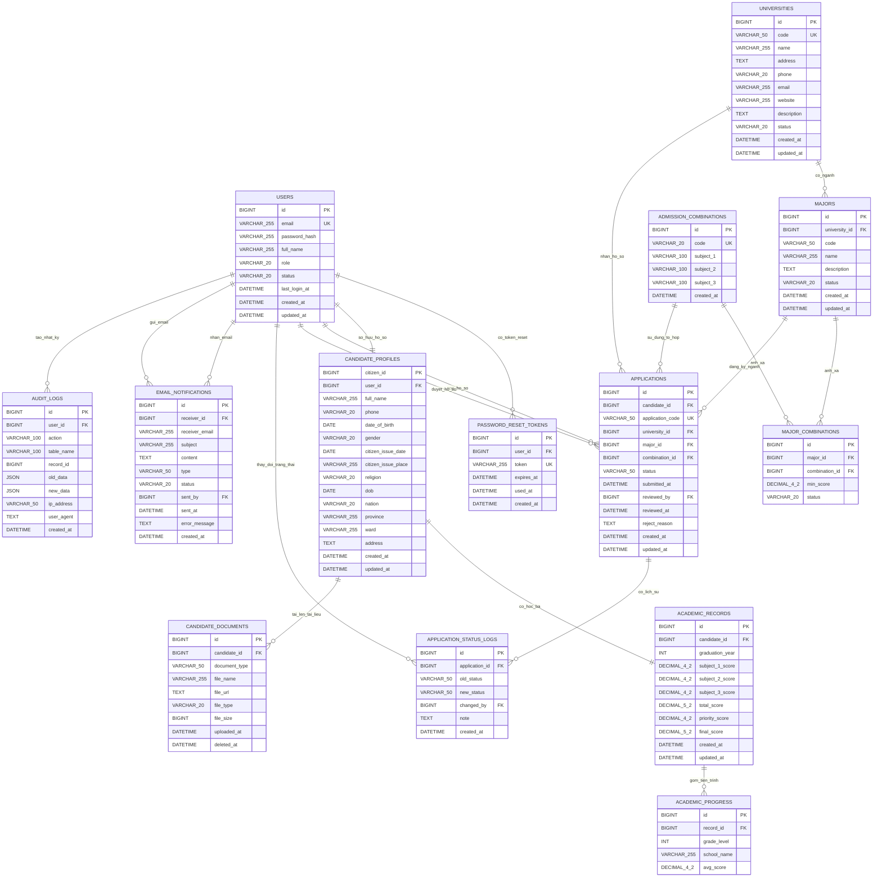

# Mermaid ERD - Thiết kế CSDL vật lý

## Giá trị Enum
- `user_role`: `CANDIDATE`, `ADMIN`
- `user_status`: `ACTIVE`, `LOCKED`, `PENDING`
- `common_status`: `ACTIVE`, `INACTIVE`
- `gender`: `MALE`, `FEMALE`, `OTHER`
- `application_status`: `DRAFT`, `SUBMITTED`, `PENDING_REVIEW`, `APPROVED`, `REJECTED`, `PASSED`, `FAILED`
- `document_type`: `TRANSCRIPT`, `CITIZEN_ID`, `PORTRAIT`, `CERTIFICATE`, `OTHER`
- `file_type`: `PDF`, `JPEG`, `PNG`
- `email_type`: `APPLICATION_SUBMITTED`, `STATUS_CHANGED`, `MANUAL`, `PASSWORD_RESET`
- `email_status`: `PENDING`, `SENT`, `FAILED`

## Ghi chú ràng buộc
- Khóa unique của `majors`: (`university_id`, `code`)
- Khóa unique của `major_combinations`: (`major_id`, `combination_id`)
- `academic_records.candidate_id` là unique
- `candidate_profiles` đang có cả `date_of_birth` và `dob` theo schema hiện tại
